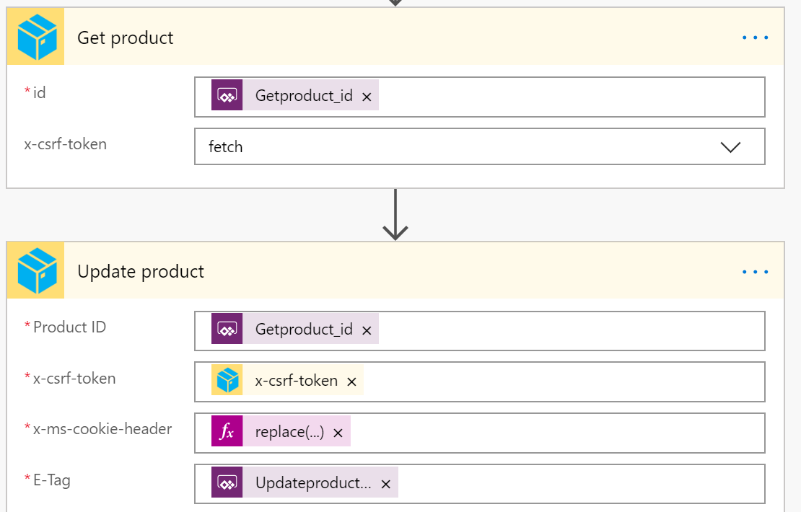
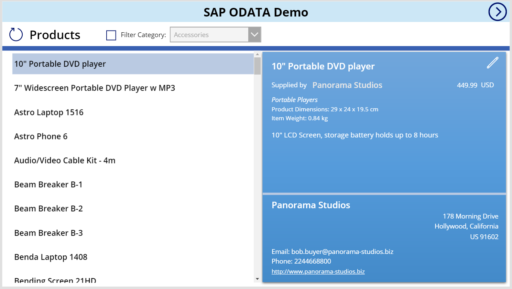
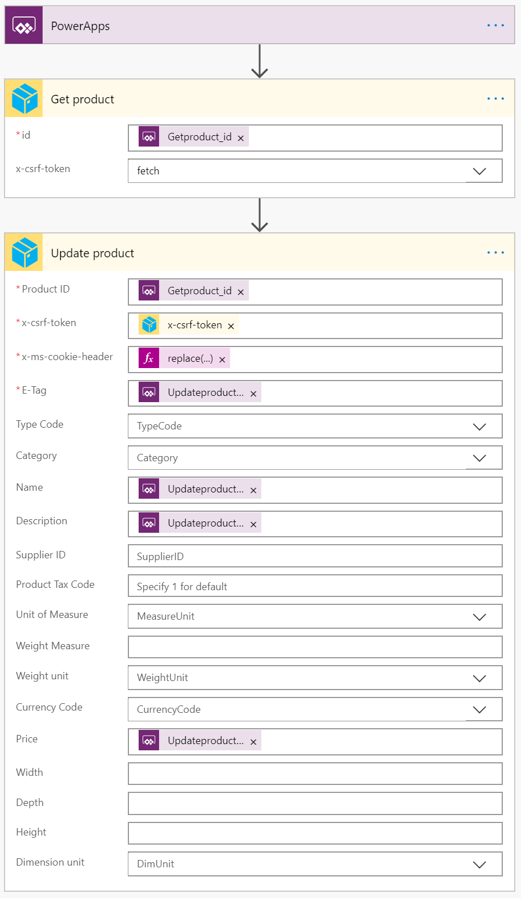
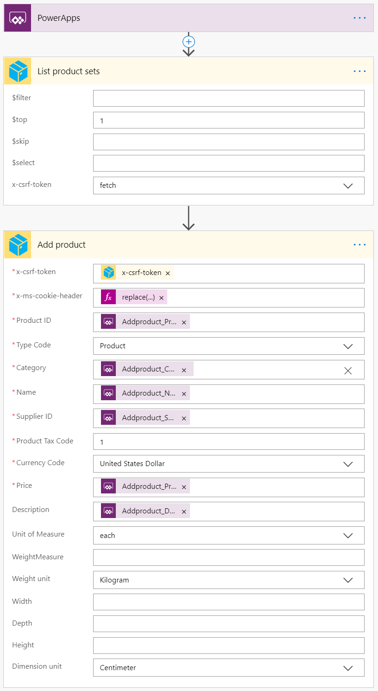
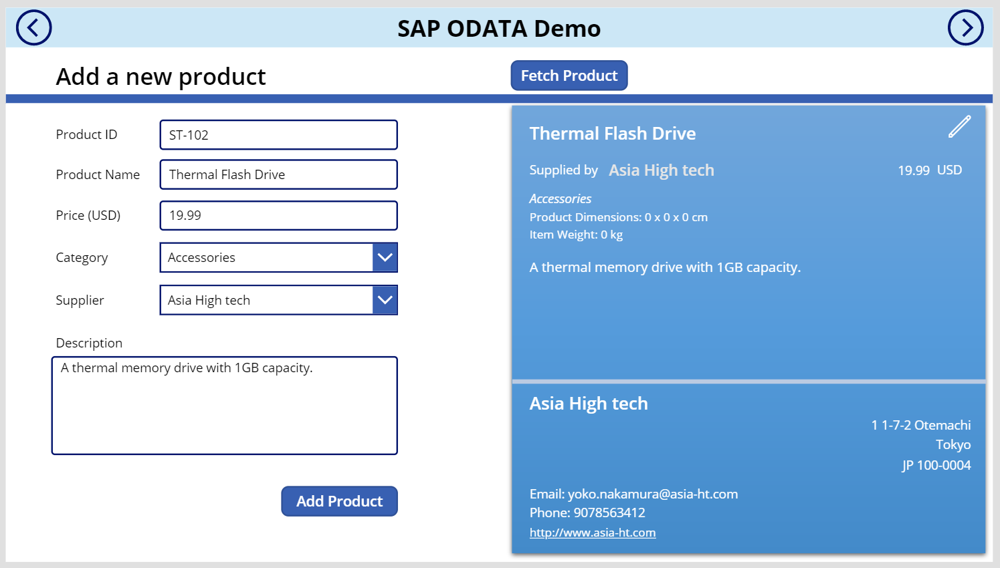

### NOTE
> This is a *sample* connector.  The connector is provided here with the intent to illustrate certain features and functionality around connectors.

# SAP ODATA [Sample] Connector
The SAP ODATA Sample connector is meant to be used to illustrate how you can connect to an SAP ODATA service from Power Apps and Power Automate.

This connector connects to the [Sample ODATA service on the demo SAP Gateway from SAP](https://help.sap.com/viewer/68bf513362174d54b58cddec28794093/1809BW.001/en-US/59283fc4528f486b83b1a58a4f1063c0.html). This ODATA services provides basic (CRUDQ) operations againsts a set of entities - Products, Partners, SalesOrders, and Contacts.

This connector provides functionality to browse Products, Partners and Salesorders. You can also create or update Products using the connector. You can easily extend this to add more functionality as needed (for example: listing Contacts or Sales Order details/line items).

## Pre-requisites
You will need the following to proceed:
* A Microsoft Power Apps or Power Automate plan with custom connector feature
* The Power platform CLI tools
* Access to the SAP ODATA Sample Service. If you dont have access, you can [sign up from SAP](https://developers.sap.com/tutorials/gateway-demo-signup.html).


## Deploying the connector
Run the following commands and follow the prompts:

```paconn
paconn create -s settings.json
```

## Supported Operations
The connector supports the following operations:
* `List product sets`: Fetch the list of products
* `Add product`: Add a product
* `Get product`: Retrieve a product
* `Update product`: Update a product
* `List Sales Orders`: Fetch the list of Sales Orders
* `Get sales order`: Retrieve a Sales Order
* `List Business Partners`: Fetch the list of Business Partners
* `Get partner`: Retrieve a business partner

In addition, the connector provides a few other additional operations which are useful for providing dynamic drop-down lists:
* `List product type codes`: Retrieves the list of valid type codes
* `List product categories`: Retrieve a list of product categories
* `List currency codes`: Retrieves a list of currency code
* `List measure unit`: Retrieve a list of measure units
* `List weight units`: Retrieves a list of weight units
* `List length units`: Retrieves a list of length units

## Handling Updates
There are two main issues that you need to be aware of while handling updates:
 1. E-Tag, and
 2. Anti-CSRF tokens

The entity you want to update will have an ETAG which you need to passed in the update request as part of the HTTP `If-Match` header. This is fairly straight-forward.

Anti-CSRF tokens are used, along with session cookies, to further validate the request. You can [read on this from SAP here](https://help.sap.com/viewer/68bf513362174d54b58cddec28794093/1809BW.001/en-US/b35c22518bc72214e10000000a44176d.html). The connector defines the `x-csrf-token` input parameter for GET operations, which can take a value of `fetch`. This makes the ODATA service returns the token and session information in the response. These values can then be passed along in the PATCH/POST request. To make this simpler, we use a flow to stitch this together - as shown.

The session info is extracted from the `Set-Cookie` header and passed explicitly. In an ideal world, you will have a connector which will take care of session management automatically. The header will also need to parse properly, however, a simple string replace will make do for us now:
>replace(outputs('Get_product')['headers']['Set-Cookie'],',',';')

Once that is done, your updates will start working. This is how the flow will look like: 



## Sample Canvas app
You can find a sample canvas app "SAP EPM Products Demo Starter.msapp" in this folder to illustrate how you may use the connector from a canvas app.

To build the app, you will need to:
* Sign for SAP Gateway account which will give you access to the ODATA service
* Deploy the custom connector from GitHub
* Create a new app using the sample
* Add the custom connector to your app

The basic functionality of the app should be working now.  This will allow you to browse products using the ODATA feed.



### Update a product
To add support for updates, you will use a flow, as explained above.
* Create a new flow using PowerApps trigger
* Add a new step for the “Get product” action of the custom connector
    * For `id`, take it as a parameter from the app
    * Set the `x-csrf-token` to `fetch`
* Add a new step for “Update product” action of the custom connector
    * `Product ID`: Set to the same parameter from the app
    * `x-csrf-token`: Set to the `x-csrf-token` output from the previous step
    * `x-ms-cookie-header`: Set to the expression: `replace(outputs('Get_product')['headers']['Set-Cookie'],',',';')`
    * `E-Tag`/`Name`/`Description`/`Price`: Set to an input from the app

You can add more (or less) parameters based on what fields you want to update. Save and test the flow to see if it is working.  Your flow will look like below:




The next step is for us to add this flow in our app:
* Go to Component > ProductBox > UpdateButton
* Select the “OnSelect” action
* Click Action > Power Automate and add the flow you created above
* Finish assigning the parameters for your flow<br/>
`'PowerApp->Getproduct,Updateproduct'.Run(ProductBox.Product.ProductID, ProductBox.Product.__metadata.etag, ProductNameTB.Text, DescriptionTB.Text, PriceTB.Text)`

NOTE: The name of the flow and the parameters may be different based on your flow.

Save and test your app.


### Adding a new product
To add support for adding new products, you will use a flow, as explained above.

* Create a new flow using PowerApps trigger
* Add a new step for the “List product sets” action of the custom connector
    * Set `$top` to 1
    * Set the `x-csrf-token` to `fetch`
* Add a new step for “Add product” action of the custom connector
    * `x-csrf-token`: Set to the `x-csrf-token` output from the previous step
    * `x-ms-cookie-header`: Set to the expression to<br/>
    `replace(outputs('List_product_sets')?['headers/Set-Cookie'],',',';')`
    * `Product ID`: Set to the same parameter from the app
    * `Type Code`: Set to `Product` (or PR)
    * `Category`/`Name`/`SupplierID`/`Description`/`Price`: Set to an input from the app
    * `Product Tax Code`: Set to 1
    * `Currency Code`: Set to `United States Dollar` (or USD)

You can add more (or less) parameters based on what fields you want to update during the creation. Save and test the flow to see if it is working.  Your flow will look like below:



The next step is for us to add this flow in our app
* Go to Screens > AddProductScreen > CreateButton
* elect the “OnSelect” action
* Click Action > Power Automate and add the flow you created above
* Finish assigning the parameters for your flow<br/>
`'PowerApp->Addproduct,Listproductsets'.Run(ProductIDinputTB.Text, CategoryDD.Selected.Category, ProductNameInputTB.Text, SupplierDD.Selected.BusinessPartnerID, PriceInputTB.Text, DescriptionInputTB.Text)`

NOTE: The name of the flow and the parameters may be different based on your flow.

Save and test your app.


